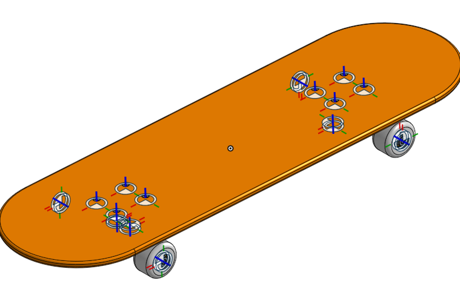
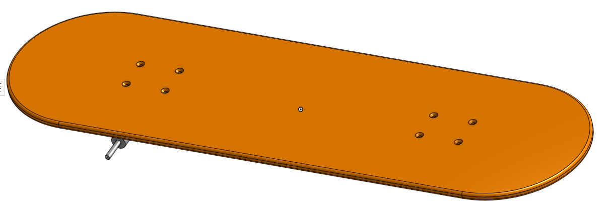
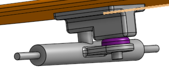
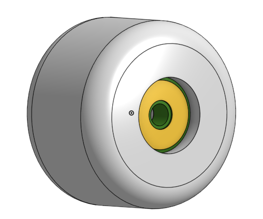
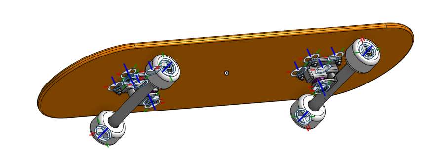

# OnShape
## Skateboard

https://cvilleschools.onshape.com/documents/67a0d2cbc87a9ce9ab1301b7/w/fa9c67b884daed17232e0a12/e/e78c9fe9f413c2e95b7cc839?renderMode=0&uiState=61807599d0016b22ef4bd967

### Description
My assignment was to construct a skateboard in OnShape, following a lesson. I had to follow each step exactly because there were assignments asking for the weight of your skateboard, and it had to be within .01 gram of the actual mass.

### Reflection
It was a long assignment, that taught me a lot of useful tools along the way which will help me with my future projects. Useful tools and in the skateboard were different part studios to keep my parts seperate, and the add vs. new feature when deciding if you want an extrusion to be a new part.

## Deck

https://cvilleschools.onshape.com/documents/67a0d2cbc87a9ce9ab1301b7/w/fa9c67b884daed17232e0a12/e/e78c9fe9f413c2e95b7cc839?renderMode=0&uiState=61807599d0016b22ef4bd967

### Description
My assignment was to create a wooden skateboard deckm in OnShape, and add holes for assembly later.

### Reflection
It was hard to get the holes to pattern correctly at first but I discovered the "Solve" button which will almost always format your sketch in a way that makes it easier to extrude. Another useful tool is a variable if you need multple filits or dimensions to be the same size.

## Trucks

https://cvilleschools.onshape.com/documents/67a0d2cbc87a9ce9ab1301b7/w/fa9c67b884daed17232e0a12/e/e78c9fe9f413c2e95b7cc839?renderMode=0&uiState=61807599d0016b22ef4bd967

### Description
I was to make 3 two part truck system for the skateboard, and put the 2 parts together with a smaller bushing in between them.

### Reflection
I had to create the trucks part by part and it was interesting to see it come together. It was cool to add in the bushing as a new part, and the lesson was useful in it's description of add to simply add an extrusion to a part, or create a new one using the new feature.

## Wheels and Bearings

https://cvilleschools.onshape.com/documents/67a0d2cbc87a9ce9ab1301b7/w/fa9c67b884daed17232e0a12/e/e78c9fe9f413c2e95b7cc839?renderMode=0&uiState=61807599d0016b22ef4bd967

### Description
My assignment was to create a skateboard wheel and a bearing to make it have the appearance of a true skateboard wheel.

### Reflection
In this assignment I used the revolve tool in OnShape for the first time, then added fillets to give it a real skaeboard wheel look. It was cool to make and extrude a sketch, and the onshape revolution tool is easy to use and get to the correct amount of degrees.

## Assembly

https://cvilleschools.onshape.com/documents/67a0d2cbc87a9ce9ab1301b7/w/fa9c67b884daed17232e0a12/e/e78c9fe9f413c2e95b7cc839?renderMode=0&uiState=61807599d0016b22ef4bd967

### Description
My assignment was to assemble the trucks, board and wheels, then add bolts and screws to add a real effect.

### Reflection
It was much easier in OnShape than on previous enginerring programs my school has used to add in bolts and screws, which I liked. I used two types of mates to secure all the parts and finish my board.
